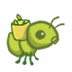
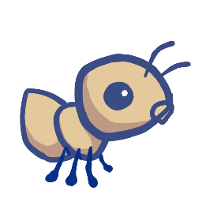
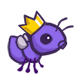

# Ants vs. Some Bees

**This is one of the projects assigned to students in cs61a of UC Berkeley. This project is fairly easy but is really fun to do, for source files checkout: https://github.com/n0rea5on/CS61A-2020-Fall-Metarials-Mirror.**

#### 1.

Note that you can only access the game via terminal with the following command.

```cmd
python gui.py [-h] [-d DIFFICULTY] [-w] [--food FOOD]
```

**Optional argument:**

> `[-h]`, `[--help]`: Display some default help message
>
> `[-d DIFFICULTY]`: Sets difficulty of game (test/easy/medium/hard/extra-hard)
>
> `[-w]`, `[--water]`: Loads a full layout with water
>
> `[--food FOOD]`: Number of food to start with when testing

#### 2.

There are all sorts of ants you can use to defend against the bees. And I'm going to give a brief introduction on each of theirs functions.

- The Harvest Ants

  

  | Cost | Armor |
  | ----- | ----- |
  | 2    | 1     |

  >Acuires one food per round. Deals absolutely zero damage.
  >

- The Thrower Ant

  

  | Cost | Armor | Damage |
  | ------ | ------ | ------ |
  | 3    | 1     | 1      |

  > Attacks the first bee in front of it in its line.

- The Short Thrower Ant ~~(What a absolutely abomination of a name.)~~

  

  | Cost | Armor | Damage |
  | ------ | ------ | ------ |
  | 2    | 1     | 1      |

  > Attacks the first bee no farther than three blocks in front of it.

- The Long Thrower Ant

  

  | Cost | Armor | Damage |
  | ------ | ------ | ------ |
  | 2    | 1     | 1      |

  > Attacks the first bee no nearer than five blocks in front of it.

- The Fire Ant

  

  | Cost | Armor | Damage  |
  | ------- | ------- | ------- |
  | 5    | 3     | Depends |

  > Reflects the damage it recieves to ALL of the bees in its 'Space'. Deals an additional 3 damage when it is destroyed.

- The Hungry Ant

  

  | Cost | Armor | Damage   |
  | -------- | -------- | -------- |
  | 4    | 1     | Infinity |

  > Eats the bee in its place, and then spend three rounds chewing.

- The Wall Ant

  

  | Cost | Armor |
  | ----- | ----- |
  | 4    | 4     |

  > Blocks the bees.

- The Scuba Thrower Ant

  

  | Cost | Armor | Damage |
  | ----- | ----- | ------ |
  | 6    | 1     | 1      |

  > A special kind of Thrower Ant that can live in water(and also on land).

- The Queen Ant

  

  | Cost | Armor | Damage |
  | ------ | ------ | ------ |
  | 7    | 1     | 1      |

  > This one is fairly complicated.
  >
  > Firstly, there can be at most one Queen ant. Any other queen ant will die immediately.
  >
  > Secondly, once the one real queen ant dies, the you lose the game.
  >
  > Thirdly, the queen ant can double the damage of all the ants behind it.
  >
  > Lastly, the queen ant can live on both land and water.

- The Ninja Ant

  

  | Cost | Armor | Damage |
  | ------ | ------ | ------ |
  | 5    | --    | 1      |

  >  The Ninja Ant doesn't block the bees' path, but damages them as they pass by.

- The Bodyguard Ant

  

  | Cost | Armor |
  | ----- | ----- |
  | 4   | 2    |

  > The Bodyguard Ant is a type of Container Ant, which means it can be put in a 'place' that an ant already occpies.

- The Tank Ant

  

  | Cost | Armor | Damage |
  | ---- | ----- | ------ |
  | 6    | 2     | 1      |

  > Also a type of Container Ant. Attacks ALL the bees in its place and deals 1 damage.

- The Laser Ant

  

  | Cost | Armor | Damage      |
  | ---- | ----- | ----------- |
  | 10   | 1     | Complicated |

  > This is a very special weapon, use it wisely.
  >
  > Its original damage is 2. But the damage decreases by distance at the rate of 0.25 per block. And each time the laser hits an insect, the damage decreases by 0.0625 permanantly.
  >
  > What's more, the laser can attack all the insects(bees and ants) in front of the laser ant.

#### 3.

There are also some special bees in the game, but they basically look the same, so there's no use describing them.


**Good Luck!**
